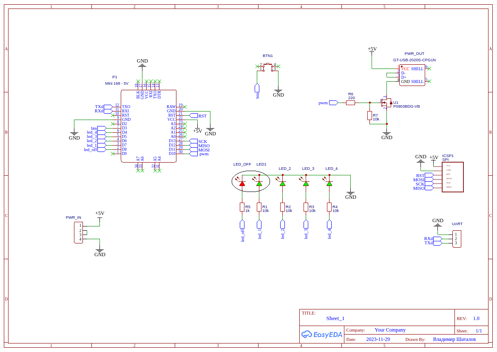

## PWM Controller

Простой ШИМ-контроллер для ступенчатого управления нагрузкой.

- [Используемые контроллеры](#используемые-контроллеры)
- [Управление](#управление)
- [Настройки скетча](#настройки-скетча)
- [Индикация](#индикация)
- [Схема подключения](#схема-подключения)
- [Использованные сторонние библиотеки](#использованные-сторонние-библиотеки)

### Используемые контроллеры
Прибор может быть собран как на классической **Arduino** с применением контроллеров **Atmega168/328**, так и на контроллерах **Attiny45/85**, например **Digispark**;

При использовании контроллеров **Attiny45/85** в Arduino IDE рекомендуется использование пакета **ATTinyCore**(ссылка для установки пакета в Arduino IDE - http://drazzy.com/package_drazzy.com_index.json)

### Управление
Изменение уровня мощности нагрузки (коэффициент заполнения ШИМ) может выполняться как одной кнопкой (**btn_up**), так и двумя (**btn_up** + **btn_down**); 

Если вторая кнопка не нужна, можно отключить генерацию кода для нее, для этого нужно закомментировать строку `#define USE_TWO_BUTTONS` в файле **header_file.h**;

Удержание любой кнопки нажатой в течение 1 секунды отключает нагрузку, включение - клик любой кнопкой; при включении восстанавливается последний уровень мощности;

### Настройки скетча
Настройки параметров скетча делаются в блоке **Настройки** в файле **header_file.h**;

При использовании Arduino для уменьшения размера кода можно отключить вывод отладочной информации в `Serial`, для этого нужно закомментировать строку `#define LOG_ON` в файле **header_file.h**; для **Attiny45/85** `Serial` в любом случае не используется;

ШИМ-контроллер по умолчанию имеет четыре уровня мощности, однако количество уровней может быть произвольным и определяется размером массива `pwm_data_table`, в котором задаются величины коэффициента заполнения ШИМ для каждого уровня (в интервале **0..255**); для примера в коде есть два варианта массива: с линейной зависимостью - для управления, например, нагревателем, и с нелинейной зависимостью - для управления, например, светодиодной лентой; нелинейность связана с нелинейным восприятием уровней освещенности зрением человека;

Перебор значений массива `pwm_data_table` производится по клику любой кнопки и может быть закольцован (по достижению последнего значения следующий клик включает первое и наоборот); если вы используете две кнопки, и кольцевой перебор вам не нужен, присвойте переменной `LOOP_DATA_OF_PWM` значение **false**; для одной кнопки (если строка `#define USE_TWO_BUTTONS` закомментирована) эта константа не используется, перебор в любом случае закольцован;

Включение нагрузки может быть плавным - например, запуск освещения; для активации этой опции присвойте значение **true** переменной `SMOOTH_START`; время запуска нагрузки от 0% до 100% заполнения ШИМ занимает примерно 0,5 секунды;

### Индикация
Текущий уровень мощности индицируется линейкой из пяти светодиодов (для **Arduino** - один красный и четыре зеленых) или двух (для **Attiny45/85** - красный и зеленый); красный светодиод зажигается при выключенной нагрузке;

Вместо красного и первого зеленого светодиодов можно использовать один двухцветный светодиод с общим катодом;

### Схема подключения

Пины для подключения кнопок, светодиодов и вывода ШИМ определяются в блоках __ARDUINO__ (для **Arduino**) и __DIGISPARK__ (для **Attiny45/85**);

 ### Использованные сторонние библиотеки

**shButton.h** - https://github.com/VAleSh-Soft/shButton 

